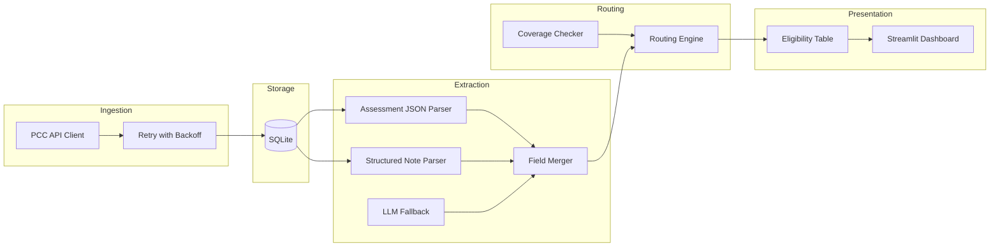
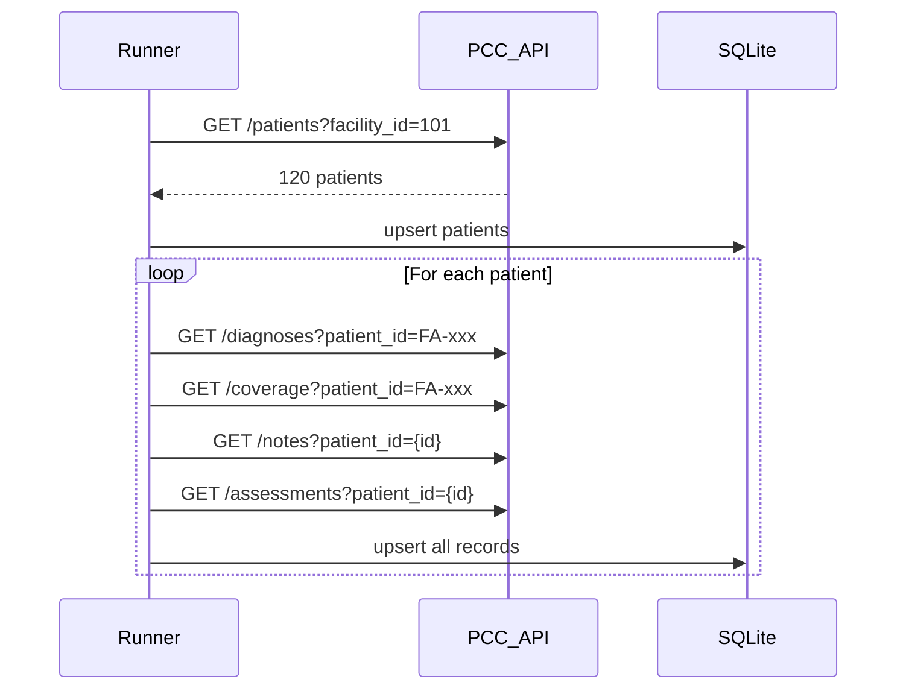

# Wound Care Billing Pipeline — System Design

## Goal

Build a maintainable data pipeline that automates the biller's triage workflow: pull patient data from the mock PCC API, extract wound documentation, determine Medicare Part B eligibility, and route each patient to `auto_accept`, `flag_for_review`, or `reject` with a plain-English reason — surfaced in a visual dashboard.

## High-Level Architecture



## Recommended Project Structure

```
Hackathon-ABI-Frameworks/
├── pyproject.toml              # deps: httpx, tenacity, pydantic, streamlit, openai (optional)
├── .env.example                # API_BASE_URL, OPENAI_API_KEY (optional)
├── src/
│   ├── config.py               # settings, facility IDs, payer codes
│   ├── client/
│   │   └── pcc_client.py       # HTTP client + 429 retry
│   ├── ingest/
│   │   └── pipeline.py         # orchestrates full fetch per facility
│   ├── db/
│   │   ├── schema.sql          # table definitions
│   │   └── repository.py       # CRUD + upserts
│   ├── extract/
│   │   ├── assessment.py       # parse raw_json
│   │   ├── notes.py            # SOAP/prose/multi-wound regex parsers
│   │   ├── llm.py              # LLM fallback for Envive/ambiguous
│   │   └── merger.py           # combine note + assessment into one record
│   ├── route/
│   │   └── eligibility.py      # coverage check + routing decisions
│   └── dashboard/
│       └── app.py              # Streamlit UI
├── scripts/
│   └── run_pipeline.py         # CLI entry: ingest → extract → route
└── data/
    └── pipeline.db             # gitignored SQLite file
```

**Existing repo assets** (already in place):
- [`scripts/probe_api.py`](scripts/probe_api.py) — API smoke test + demo JSON capture
- [`demo_outputs/`](demo_outputs/) + [`DEMO_DATA.md`](DEMO_DATA.md) — sample responses for SOAP, Prose, Envive, multi-wound, and ineligible patients

## Core Data Model

Two patient identifiers must be preserved everywhere ([API.md](API.md)):

| ID type | Example | Used for |
|---|---|---|
| `patient_id` (string) | `FA-001` | diagnoses, coverage |
| `id` (integer) | `1` | notes, assessments |

### SQLite tables (raw + derived)

**Raw ingestion tables** — mirror API responses with `fetched_at` timestamp:
- `patients` — all fields from `/pcc/patients`
- `diagnoses` — ICD-10 records
- `coverage` — payer records
- `notes` — progress notes (`note_text` is extraction input)
- `assessments` — structured forms (`raw_json` is primary extraction input)

**Derived tables** — pipeline output:
- `wound_extractions` — one row per patient per extraction source (note vs assessment), with confidence score
- `patient_eligibility` — **final biller-facing table**, one row per patient

### `patient_eligibility` output schema

| Column | Type | Purpose |
|---|---|---|
| `patient_id` | string | PCC identifier |
| `internal_id` | int | for cross-reference |
| `facility_id` | int | 101/102/103 |
| `patient_name` | string | `first_name last_name` |
| `wound_type` | string | normalized enum |
| `wound_stage` | int/null | pressure ulcers only |
| `location` | string | body site |
| `length_cm`, `width_cm`, `depth_cm` | float/null | measurements |
| `drainage_amount` | enum | none/light/moderate/heavy |
| `has_active_mcb` | bool | Medicare Part B active today |
| `has_active_wound_dx` | bool | active wound-related ICD-10 |
| `routing_decision` | enum | auto_accept / flag_for_review / reject |
| `reason` | string | plain-English explanation |
| `source` | string | assessment / note / merged |
| `confidence` | float | 0.0–1.0 extraction confidence |
| `processed_at` | timestamp | last pipeline run |

## Stage 1: API Client & Ingestion

### PCC client ([`src/client/pcc_client.py`](src/client/pcc_client.py))

- Base URL: `https://hackathon.prod.pulsefoundry.ai`
- Use `httpx` with a thin wrapper per endpoint: `get_patients`, `get_diagnoses`, `get_coverage`, `get_notes`, `get_assessments`
- **429 handling** (required): on HTTP 429, read `Retry-After` header (1–5s), sleep, retry. Wrap with `tenacity` — max 8 retries, respect `Retry-After` as minimum wait
- Log each retry; surface persistent failures per patient without aborting the whole run

### Ingestion orchestration ([`src/ingest/pipeline.py`](src/ingest/pipeline.py))



**Fetch strategy for hackathon:**
- Sequential per-patient requests (simple, debuggable). ~1,500 requests total (300 patients × 5 endpoints) — acceptable with retries
- Optional later: bounded concurrency (e.g. 3 workers) if runtime is too slow
- Process all 3 facilities: `101`, `102`, `103`
- Upsert on natural keys (`patient_id`, note `id`, etc.) so re-runs are idempotent

**Bonus hook (incremental sync):** persist `last_sync_at` per facility in SQLite; pass `since` to `/patients`, `/notes`, `/assessments` on subsequent runs.

## Stage 2: Wound Extraction (Hybrid)

Extraction runs per patient, preferring the most reliable source first.

### Priority order

1. **Assessments** (`raw_json`) — highest confidence. Parse JSON directly; map `wound_type`, `stage`, `location`, `length_cm`, `width_cm`, `depth_cm`, `drainage_amount`. Confidence: **0.95**
2. **Structured SOAP notes** — labeled fields (`Location:`, `Wound Type:`, `Length:`). Regex templates in [`src/extract/notes.py`](src/extract/notes.py). Confidence: **0.85**
3. **Prose / abbreviated notes** — patterns like `Meas 4.2x3.1x1.5cm`, shorthand drainage. Regex with validation. Confidence: **0.70**
4. **Multi-wound notes** — detect multiple wounds; pick primary (first documented, or largest measurements, or explicit "primary"). Flag ambiguity. Confidence: **0.60**
5. **Envive narrative** — LLM fallback in [`src/extract/llm.py`](src/extract/llm.py) with a strict JSON schema prompt. Confidence: **0.50–0.75** depending on field completeness

### Merger logic ([`src/extract/merger.py`](src/extract/merger.py))

- If assessment exists and is `Complete` → use assessment as primary
- Else use best note extraction by confidence
- If note and assessment disagree on measurements (>20% delta) → lower confidence, note conflict in metadata
- Normalize enums: `pressure_ulcer` → `Pressure Ulcer`, drainage → lowercase enum

### LLM fallback design

- Trigger only when regex parsers return incomplete fields or note format is detected as Envive
- Prompt returns structured JSON matching the output schema; validate with Pydantic
- If LLM fails or returns partial data → route to `flag_for_review` or `reject` downstream
- Gate behind `OPENAI_API_KEY` env var; pipeline runs without LLM using rules-only path

## Stage 3: Eligibility & Routing Engine

### Medicare Part B check ([`src/route/eligibility.py`](src/route/eligibility.py))

A patient has active MCB if any coverage record has:
- `payer_code == "MCB"` (or `payer_type == "Medicare B"`)
- `effective_from <= today`
- `effective_to IS NULL` (still active)

Also cross-check `primary_payer_code` on patient record as a secondary signal.

### Wound diagnosis signal

Scan active diagnoses for wound-related ICD-10 prefixes: `L89.*` (pressure ulcers), `L97.*` (lower limb ulcers), `T31.*` (burns), etc. Used as supporting evidence, not sole source of wound type.

### Routing rules

| Decision | Conditions |
|---|---|
| **reject** | No extractable wound data at all, OR no active wound signal (no extraction + no wound ICD-10), OR patient clearly non-MCB with no wound billing path |
| **auto_accept** | Active MCB + all 5 required fields present (type, L/W/D measurements, drainage) + confidence ≥ 0.80 + single unambiguous wound + assessment or SOAP source |
| **flag_for_review** | Everything else: partial fields, low confidence, multi-wound ambiguity, prose-only source, note/assessment conflict, non-MCB payer, missing stage on pressure ulcer |

### Reason strings (biller-facing examples)

- `auto_accept`: "Medicare Part B active. Wound fully documented in structured assessment (sacral pressure ulcer stage 2, 3.2×2.1×0.4 cm, moderate drainage)."
- `flag_for_review`: "Medicare Part B active but wound details extracted from unstructured narrative with low confidence. Measurements may need clinician verification."
- `reject`: "No wound documentation found in notes or assessments. Cannot route to billing."

## Stage 4: Streamlit Dashboard

[`src/dashboard/app.py`](src/dashboard/app.py) — biller-facing, no raw JSON.

### Layout

1. **Summary cards** — counts: Auto Accept / Flag for Review / Reject / No MCB
2. **Filter bar** — facility, routing decision, payer, search by name/ID
3. **Main table** — sortable columns: Patient, Facility, Wound Type, Location, Measurements, Drainage, MCB, Decision, Reason
4. **Detail panel** — click a row to see: source note snippet, assessment JSON summary, active diagnoses, coverage records
5. **Color coding** — green (auto_accept), amber (flag_for_review), red (reject)

### Non-technical presentation flow (for 10-min demo)

1. Show summary: "Of 300 patients, X are ready for billing, Y need review"
2. Drill into one `auto_accept` patient — walk through why each field is documented
3. Show one `flag_for_review` — explain what the biller should verify
4. Show one `reject` — explain why it should not be routed

## End-to-End Run Flow

```bash
# 1. Install
pip install -e .

# 2. Run full pipeline
python scripts/run_pipeline.py

# 3. Launch dashboard
streamlit run src/dashboard/app.py
```

`run_pipeline.py` executes: **ingest → extract → route → write patient_eligibility**.

## Key Design Tradeoffs

| Choice | Rationale |
|---|---|
| SQLite over files | Queryable, supports dashboard filters, easy demo setup |
| Hybrid extraction | Fast/reliable for 60%+ structured data; LLM only where needed (cost + latency) |
| Assessment over note | Structured assessments are higher-trust for `auto_accept` |
| Sequential ingestion | Simpler error handling for hackathon; upgrade to concurrency if slow |
| One row per patient output | Matches biller mental model; extraction details in side table |

## Risks & Mitigations

- **429 storms**: tenacity retry + per-patient error collection; re-run script for failures only
- **ID confusion**: enforce typed models (`PccPatientId` vs `InternalPatientId`) in client
- **Multi-wound ambiguity**: always `flag_for_review` unless primary wound is explicit
- **LLM hallucination**: validate ranges (measurements > 0, stage 2–4), require confidence threshold for `auto_accept`

## Implementation Order

Build bottom-up so each stage is testable independently:

1. Config + PCC client with retry (verify against `/health`)
2. SQLite schema + repository
3. Ingestion for one facility, then all three
4. Assessment parser (quick win — structured JSON)
5. Note regex parsers (SOAP, prose, multi-wound)
6. Merger + eligibility router
7. LLM fallback (optional path)
8. Streamlit dashboard
9. CLI orchestrator + README run instructions
